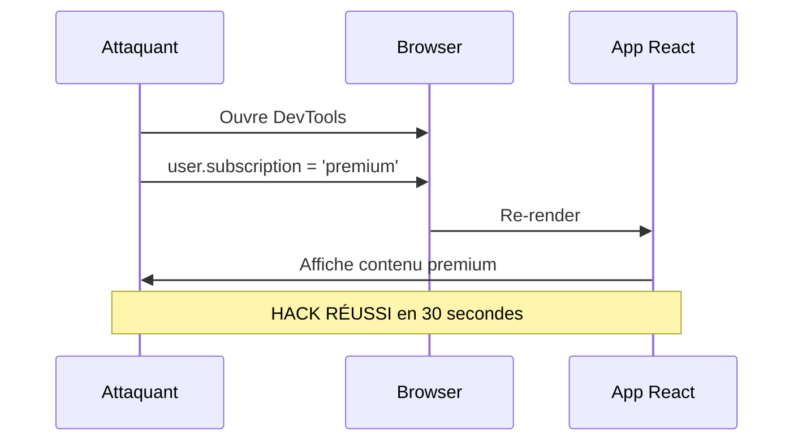
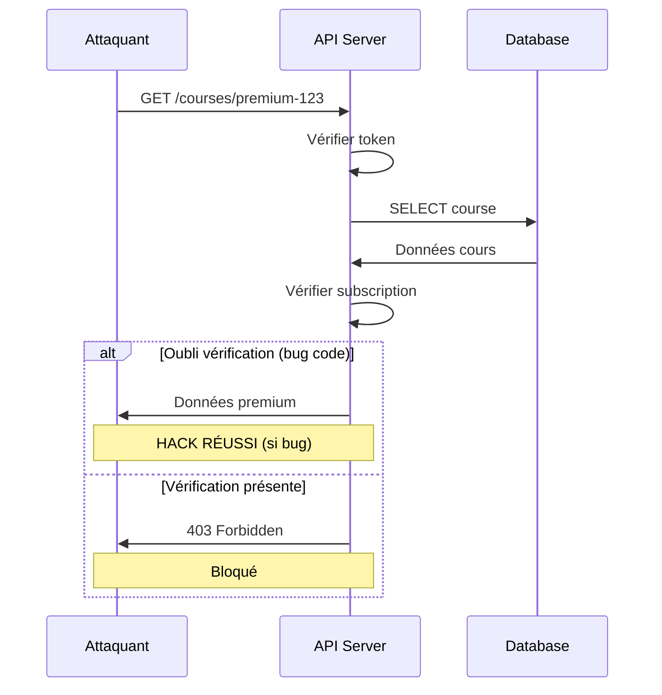
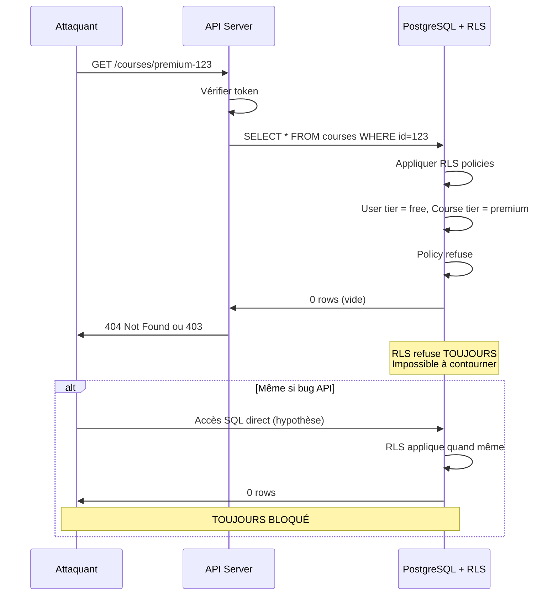
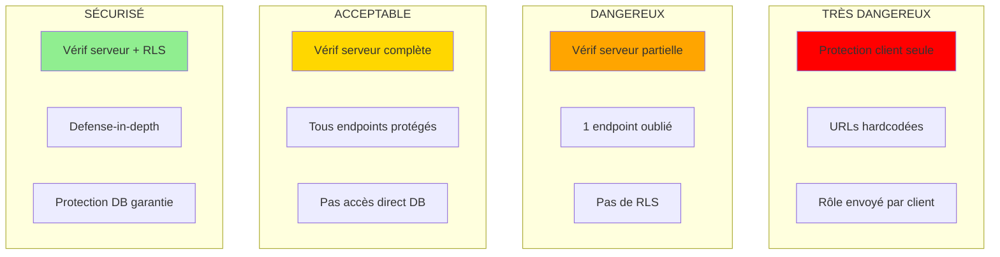
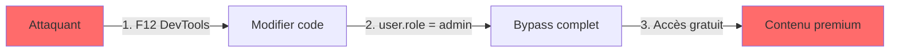
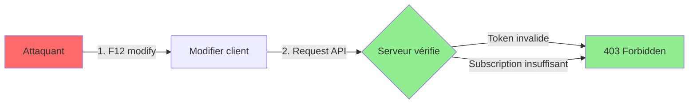
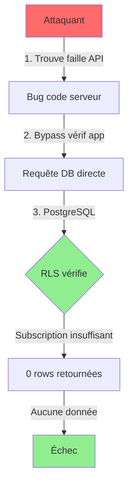

# Protection Routes : Client vs Serveur - Dangers et Hacking

**Démonstration des failles de sécurité côté client**

---

## Introduction

Ce document illustre pourquoi la protection côté client est dangereuse et comment un attaquant peut facilement contourner ces protections.

**Règle d'or** : Ne jamais faire confiance au client

---

## Protection Côté Client (DANGEREUSE)

### Exemple Typique

**Code React protection côté client** :

```javascript
// components/PremiumCourse.jsx
function PremiumCourse({ course }) {
  const { user } = useAuth()
  
  // Protection côté client
  if (user.subscription !== 'premium') {
    return <div>Upgrade to Premium to access</div>
  }
  
  return (
    <div>
      <h1>{course.title}</h1>
      <video src={course.videoUrl} />
      <a href={course.pdfUrl}>Download PDF</a>
    </div>
  )
}
```

**Ce qui semble protégé** :
- User non-premium voit message "Upgrade"
- Vidéo et PDF cachés dans UI

---

## Comment Hacker Protection Client

### Attaque 1 : Console JavaScript (30 secondes)

**Étapes attaquant** :

1. Ouvrir DevTools (F12)
2. Onglet Console
3. Modifier objet user :

```javascript
// Dans console Chrome/Firefox
user.subscription = 'premium'

// Ou directement
localStorage.setItem('user', JSON.stringify({
  ...user,
  subscription: 'premium'
}))

// Rafraîchir page
location.reload()
```

**Résultat** : Accès contenu premium gratuitement

**Temps requis** : 30 secondes

**Compétence** : Aucune (tutorial YouTube)

---

### Attaque 2 : Inspect Element (15 secondes)

**Étapes attaquant** :

1. Clic droit sur message "Upgrade"
2. "Inspect Element"
3. Supprimer élément dans DOM
4. Élément vidéo/PDF devient visible

**Ou modifier directement** :

```html
<!-- Avant (dans inspecteur) -->
<div style="display: none;">
  <video src="premium-course.mp4"></video>
</div>

<!-- Après (changer dans inspecteur) -->
<div style="display: block;">
  <video src="premium-course.mp4"></video>
</div>
```

**Résultat** : Vidéo visible et jouable

**Temps requis** : 15 secondes

---

### Attaque 3 : Récupérer URLs Directement

**Si URLs présentes dans code source** :

```javascript
// Code React (visible dans bundle)
const course = {
  videoUrl: 'https://cdn.example.com/premium-video.mp4',
  pdfUrl: 'https://cdn.example.com/premium-guide.pdf'
}
```

**Étapes attaquant** :

1. View Source (Ctrl+U)
2. Rechercher "videoUrl" ou ".mp4"
3. Copier URL
4. Ouvrir dans nouvel onglet
5. Télécharger gratuitement

**Temps requis** : 60 secondes

---

### Attaque 4 : React DevTools

**Étapes attaquant** :

1. Installer React DevTools
2. Inspecter component
3. Voir tous les props/state
4. Modifier state directement

```javascript
// Dans React DevTools
component.state.isPremium = true
component.forceUpdate()
```

**Résultat** : Bypass complet

---

### Attaque 5 : Network Tab

**Étapes attaquant** :

1. F12 → Network tab
2. Regarder requêtes
3. Copier requête API
4. Rejouer avec curl/Postman

```bash
# Copié de Network tab
curl 'https://api.example.com/courses/premium-123' \
  -H 'Authorization: Bearer fake-token'
```

**Si API pas protégée côté serveur** : Fonctionne

---

## Tableau Vulnérabilités Client

| Attaque | Difficulté | Temps | Outils | Compétence |
|---------|-----------|-------|--------|------------|
| **Console modify** | Très facile | 30s | DevTools | Aucune |
| **Inspect element** | Très facile | 15s | DevTools | Aucune |
| **View source URLs** | Facile | 60s | Browser | Aucune |
| **React DevTools** | Facile | 2 min | Extension | Basique |
| **Network replay** | Facile | 5 min | curl | Basique |
| **Modify bundle** | Moyen | 10 min | webpack | Intermédiaire |
| **Proxy intercept** | Moyen | 15 min | Burp Suite | Intermédiaire |

**Constat** : Toutes les protections client contournables en moins de 15 minutes

---

## Protection Côté Serveur (SÉCURISÉE)

### Approche 1 : Serveur Application

**Code API Node.js** :

```javascript
// API route protégée
app.get('/api/courses/:id', async (req, res) => {
  // 1. Vérifier authentification
  const token = req.headers.authorization
  const user = await verifyToken(token)
  
  if (!user) {
    return res.status(401).json({ error: 'Unauthorized' })
  }
  
  // 2. Récupérer cours
  const course = await db.getCourse(req.params.id)
  
  if (!course) {
    return res.status(404).json({ error: 'Not found' })
  }
  
  // 3. Vérifier autorisation (CRITIQUE)
  if (course.tier === 'premium' && user.subscription !== 'premium') {
    return res.status(403).json({ error: 'Premium subscription required' })
  }
  
  // 4. Retourner cours
  return res.json(course)
})
```

**Protection** :
- Vérification serveur (pas contournable par console)
- Token validé côté serveur
- Autorisation vérifiée avant retour données

**Niveau sécurité** : Bon (mais pas parfait)

---

### Problème : Attaque si Accès Direct Database

**Scénario** :

```
Attaquant trouve faille dans autre endpoint
    ↓
Accès direct à la database
    ↓
SELECT * FROM courses WHERE tier = 'premium'
    ↓
Bypass complet (aucune vérification DB)
```

**Ou** :

```
Bug dans code (oubli vérification)
    ↓
1 endpoint sur 50 pas protégé
    ↓
Attaquant trouve cet endpoint
    ↓
Accès gratuit contenu premium
```

---

## Protection Database (RLS) - MAXIMALE

### Approche Sécurisée

**PostgreSQL avec RLS** :

```sql
-- Activer RLS
ALTER TABLE courses ENABLE ROW LEVEL SECURITY;

-- Policy : Accès selon tier
CREATE POLICY "access_based_on_subscription"
ON courses
FOR SELECT
USING (
  tier = 'free'
  OR
  (
    SELECT subscription_tier FROM users 
    WHERE id = auth.uid()
  ) IN ('premium', 'pro')
);
```

**Protection à tous niveaux** :

```
1. API fait requête
    ↓
2. PostgreSQL applique RLS automatiquement
    ↓
3. SI user pas premium → 0 résultats (auto)
    ↓
4. Impossible de contourner
```

**Même si** :
- API compromise
- Bug dans code
- Accès direct SQL
- Injection SQL

**RLS vérifie TOUJOURS**

---

## Démonstration Comparative

### Scénario : User Free Essaie Accéder Cours Premium

**Avec Protection Client Uniquement** :



---

**Avec Protection Serveur App** :



**Problème** : Dépend du code (erreur possible)

---

**Avec Protection Database (RLS)** :



**Garantie** : Protection à tous niveaux

---

## Tableau Comparatif Sécurité

### Résistance aux Attaques

| Type Attaque | Client | Serveur App | Serveur DB (RLS) |
|--------------|--------|-------------|------------------|
| **Console modify** | Vulnérable | Protégé | Protégé |
| **Inspect element** | Vulnérable | Protégé | Protégé |
| **View source** | Vulnérable | Protégé | Protégé |
| **Network replay** | Vulnérable | Protégé | Protégé |
| **Bug code API** | N/A | Vulnérable | Protégé |
| **Injection SQL** | N/A | Vulnérable | Protégé (RLS applique) |
| **Accès DB direct** | N/A | Vulnérable | Protégé |
| **Admin compromise** | N/A | Vulnérable | Protégé |

**Verdict** : RLS seule protection garantie

---

## Scénarios d'Attaque Réels

### Scénario 1 : Vidéo Premium Non Protégée

**Code vulnérable** :

```javascript
// Frontend
{user.isPremium && (
  <video src="https://cdn.example.com/premium-video.mp4" />
)}
```

**Faille** : URL hardcodée dans code

**Exploit** :

```bash
# Attaquant récupère URL
# Télécharge directement
wget https://cdn.example.com/premium-video.mp4
```

**Impact** : Contenu premium gratuit pour tous

---

**Code sécurisé** :

```javascript
// Frontend demande URL signée au serveur
const { signedUrl } = await fetch('/api/get-video-url?id=123')

// Serveur vérifie abonnement PUIS génère URL signée
app.get('/api/get-video-url', async (req, res) => {
  const user = await verifyToken(req.headers.authorization)
  
  if (user.subscription !== 'premium') {
    return res.status(403).json({ error: 'Premium required' })
  }
  
  // Générer URL signée (expire 1h)
  const signedUrl = generateSignedUrl(req.query.id, '1h')
  
  return res.json({ signedUrl })
})
```

**Protection** :
- URL pas dans code source
- URL signée (expire)
- Vérification serveur obligatoire

---

### Scénario 2 : API Endpoint Oublié

**Code avec bug** :

```javascript
// Route 1 : Protégée
app.get('/api/courses/:id', (req, res) => {
  const user = verifyToken(req.headers.authorization)
  if (user.subscription !== 'premium') {
    return res.status(403).send('Forbidden')
  }
  // ...
})

// Route 2 : OUBLI protection
app.get('/api/courses/:id/content', (req, res) => {
  // Oubli vérification subscription
  const content = db.getCourseContent(req.params.id)
  return res.json(content) // FAILLE
})
```

**Exploit** :

```bash
# Attaquant teste endpoints
curl https://api.example.com/api/courses/123
# 403 Forbidden

curl https://api.example.com/api/courses/123/content
# 200 OK + contenu premium (HACK RÉUSSI)
```

**Impact** : 1 endpoint oublié = faille totale

---

**Code sécurisé avec RLS** :

```javascript
// TOUS les endpoints
app.get('/api/courses/:id', async (req, res) => {
  const supabase = createClient(req.headers.authorization)
  
  // RLS vérifie automatiquement
  const { data } = await supabase
    .from('courses')
    .select('*')
    .eq('id', req.params.id)
    .single()
  
  // Si pas autorisé, data = null (RLS a bloqué)
  if (!data) return res.status(403).send('Forbidden')
  
  return res.json(data)
})

app.get('/api/courses/:id/content', async (req, res) => {
  const supabase = createClient(req.headers.authorization)
  
  // RLS vérifie AUSSI (automatique)
  const { data } = await supabase
    .from('course_content')
    .select('*')
    .eq('course_id', req.params.id)
  
  if (!data) return res.status(403).send('Forbidden')
  
  return res.json(data)
})
```

**Protection** : Même si tu oublies vérification, RLS protège

---

### Scénario 3 : Modifier Requête HTTP

**Code vulnérable** :

```javascript
// Frontend envoie rôle dans requête
fetch('/api/delete-course/123', {
  method: 'DELETE',
  body: JSON.stringify({
    userId: '456',
    role: 'user' // Envoyé par client
  })
})

// Backend fait confiance au client
app.delete('/api/delete-course/:id', (req, res) => {
  if (req.body.role !== 'admin') {
    return res.status(403).send('Admin only')
  }
  // Supprimer cours
  db.deleteCourse(req.params.id)
})
```

**Exploit** :

```bash
# Attaquant modifie requête
curl -X DELETE https://api.example.com/api/delete-course/123 \
  -H 'Content-Type: application/json' \
  -d '{"userId":"456","role":"admin"}' 
  # Attaquant met "admin" au lieu de "user"

# HACK RÉUSSI : Cours supprimé
```

**Impact** : Attaquant devient admin en changeant 1 mot

---

**Code sécurisé** :

```javascript
// Ne JAMAIS faire confiance au client
app.delete('/api/delete-course/:id', async (req, res) => {
  const user = await verifyToken(req.headers.authorization)
  
  // Vérifier rôle depuis DATABASE (pas client)
  const dbUser = await db.getUser(user.id)
  
  if (dbUser.role !== 'admin') {
    return res.status(403).send('Admin only')
  }
  
  db.deleteCourse(req.params.id)
})
```

**Règle** : Rôle/permissions toujours depuis serveur/database

---

## Niveaux de Danger

### Pyramide de Sécurité



---

## Comparaison Techniques de Hack

### Tableau Facilité Exploitation

| Protection | Hack Console | Hack Inspect | Hack Network | Hack Injection | Score Sécurité |
|------------|--------------|--------------|--------------|----------------|----------------|
| **Client seul** | Très facile | Très facile | Très facile | N/A | 0/10 |
| **Client + URLs cachées** | Très facile | Facile | Facile | N/A | 1/10 |
| **Serveur partiel** | Impossible | Impossible | Moyen | Facile | 5/10 |
| **Serveur complet** | Impossible | Impossible | Impossible | Moyen | 7/10 |
| **Serveur + RLS** | Impossible | Impossible | Impossible | Impossible | 10/10 |

---

## Exemples Concrets de Failles

### Faille 1 : Cours en Ligne Célèbre (2021)

**Ce qu'ils ont fait** :
- Protection React côté client
- URLs vidéos dans bundle JavaScript

**Exploit** :
```bash
# 1. View source
# 2. Rechercher "cloudfront.net"
# 3. Trouver toutes URLs vidéos premium
# 4. Télécharger avec wget

wget https://d123.cloudfront.net/premium-course-1.mp4
wget https://d123.cloudfront.net/premium-course-2.mp4
# ... tous les cours premium
```

**Impact** :
- 500+ cours premium téléchargés gratuitement
- Partagés sur forums pirates
- Perte estimée : 500,000 dollars

**Correction nécessaire** :
- URLs signées (expire)
- Vérification serveur
- Watermarking vidéos

---

### Faille 2 : SaaS Multi-Tenant (2022)

**Ce qu'ils ont fait** :
- Vérification organization_id côté serveur
- MAIS 1 endpoint API oublié

**Code buggé** :

```javascript
// 49 endpoints protégés
app.get('/api/projects', (req, res) => {
  const user = await verifyToken(req)
  const projects = await db.query(
    'SELECT * FROM projects WHERE org_id = ?', 
    [user.org_id]
  )
  return res.json(projects)
})

// 1 endpoint oublié (sur 50)
app.get('/api/projects/export', (req, res) => {
  // Oubli filtrage org_id
  const projects = await db.query('SELECT * FROM projects')
  return res.json(projects) // FAILLE : Tous les projets
})
```

**Exploit** :

```bash
# Attaquant teste endpoints
curl https://api.saas.com/api/projects/export

# Reçoit projets de TOUTES les organisations
# Données concurrents exposées
```

**Impact** :
- Données 500 entreprises exposées
- Violation GDPR
- Poursuites légales
- Faillite startup

**Avec RLS** : Impossible (DB aurait filtré automatiquement)

---

### Faille 3 : API E-Commerce (2023)

**Ce qu'ils ont fait** :
- Vérification serveur
- Mais confiance paramètre prix du client

**Code vulnérable** :

```javascript
// Frontend envoie prix
const checkout = async () => {
  await fetch('/api/checkout', {
    method: 'POST',
    body: JSON.stringify({
      productId: 123,
      price: 99.99 // Envoyé par client
    })
  })
}

// Backend fait confiance
app.post('/api/checkout', (req, res) => {
  stripe.charges.create({
    amount: req.body.price * 100 // FAILLE : Prix du client
  })
})
```

**Exploit** :

```bash
# Attaquant modifie prix
curl -X POST https://api.shop.com/api/checkout \
  -d '{"productId":123,"price":0.01}'
  # Produit 100 dollars acheté pour 1 centime
```

**Impact** :
- Pertes financières massives
- 1,000+ commandes à 0.01 dollar avant détection

**Code sécurisé** :

```javascript
app.post('/api/checkout', async (req, res) => {
  // TOUJOURS récupérer prix depuis database
  const product = await db.getProduct(req.body.productId)
  
  stripe.charges.create({
    amount: product.price * 100 // Prix de la DB (sécurisé)
  })
})
```

**Règle** : Ne JAMAIS faire confiance aux données client

---

## Matrice Risques

### Analyse par Type de Données

| Type Données | Protection Client | Protection Serveur | Protection RLS | Risque si Faille |
|--------------|------------------|-------------------|----------------|------------------|
| **Contenu gratuit** | OK (UX) | Bon | Excellent | Faible |
| **Contenu premium** | Dangereux | Acceptable | Obligatoire | Élevé (perte revenus) |
| **Données personnelles** | Très dangereux | Obligatoire | Obligatoire | Critique (GDPR) |
| **Données financières** | Interdit | Obligatoire | Obligatoire | Critique (légal) |
| **Multi-tenant** | Très dangereux | Risqué | Obligatoire | Critique (cross-org) |
| **Données santé** | Interdit | Obligatoire | Obligatoire | Critique (HIPAA) |

---

## Bonnes Pratiques

### Defense-in-Depth (3 Niveaux)

**Niveau 1 : Client (UX uniquement)** :
```javascript
// OK pour UX (cacher boutons)
{!user.isPremium && (
  <button disabled>Premium Only</button>
)}
```

**Usage** : Améliorer expérience utilisateur

**Sécurité** : Aucune (ne JAMAIS compter dessus)

---

**Niveau 2 : Serveur Application** :
```javascript
// Vérifier TOUJOURS côté serveur
app.get('/api/resource', (req, res) => {
  const user = verifyToken(req.headers.authorization)
  
  if (!isAuthorized(user, resource)) {
    return res.status(403).send('Forbidden')
  }
  
  // ...
})
```

**Usage** : Protection standard

**Sécurité** : Bonne (mais erreurs possibles)

---

**Niveau 3 : Database (RLS)** :
```sql
-- Protection finale garantie
CREATE POLICY "secure_access"
ON resources
USING (user_has_permission(auth.uid(), id));
```

**Usage** : Données sensibles

**Sécurité** : Maximale (impossible contourner)

---

### Checklist Sécurité

**Pour CHAQUE route protégée** :

- [ ] Vérification auth côté serveur (obligatoire)
- [ ] Vérification autorisation côté serveur (obligatoire)
- [ ] Pas de données sensibles côté client (obligatoire)
- [ ] Pas de URLs directes hardcodées (obligatoire)
- [ ] Pas de confiance paramètres client (obligatoire)
- [ ] RLS activé si données sensibles (fortement recommandé)
- [ ] Audit logs si critique (recommandé)
- [ ] Rate limiting (recommandé)

---

## Outils de Test Sécurité

### Pour Tester Tes Protections

| Outil | Usage | Difficulté | Gratuit |
|-------|-------|------------|---------|
| **Browser DevTools** | Test basique | Facile | Oui |
| **Postman** | Test API | Facile | Oui |
| **curl** | Test API | Facile | Oui |
| **Burp Suite** | Proxy intercept | Moyen | Version free |
| **OWASP ZAP** | Security scan | Moyen | Oui |
| **sqlmap** | SQL injection | Avancé | Oui |

**Recommandation** : Tester avec DevTools et Postman minimum

---

## Démonstration Visuelle

### Flow Attaque vs Défense

**Attaque Protection Client** :



**Temps** : 30 secondes

---

**Défense Protection Serveur** :



**Résultat** : Bloqué

---

**Défense Protection RLS** :



**Résultat** : Bloqué même si API compromise

---

## Tableau Synthèse

### Comparaison Finale

| Aspect | Client | Serveur App | Serveur DB (RLS) |
|--------|--------|-------------|------------------|
| **Hack console** | 30s | Impossible | Impossible |
| **Hack inspect** | 15s | Impossible | Impossible |
| **Hack network** | 60s | Impossible | Impossible |
| **Hack bug code** | N/A | Possible | Impossible |
| **Hack SQL injection** | N/A | Possible | Protégé (RLS applique) |
| **Hack accès DB** | N/A | Vulnérable | Protégé |
| **Temps moyen exploit** | < 2 min | Difficile | Impossible |
| **Compétence requise** | Aucune | Élevée | Quasi-impossible |
| **Sécurité** | 0/10 | 7/10 | 10/10 |

---

## Recommandations par Type App

### Application avec Abonnements (Ton Cas)

**Dangers si protection client** :
- Users free accèdent contenu premium
- Perte revenus directe
- Contenu partagé sur forums pirates

**Protection minimale** :
- Serveur vérifie abonnement
- URLs signées (expire)
- RLS selon tier

**Solution** : Supabase (RLS automatique)

---

### Application Multi-Tenant

**Dangers si protection serveur seulement** :
- 1 bug = cross-organization data leak
- Violation GDPR
- Poursuites légales
- Faillite possible

**Protection minimale** :
- RLS isolation OBLIGATOIRE
- Audit logs
- Tests sécurité réguliers

**Solution** : Supabase RLS (seule garantie isolation)

---

### Application Financière

**Dangers** :
- Manipulation prix
- Transactions non autorisées
- Fraude massive

**Protection minimale** :
- Backend dédié sécurisé
- Aucune confiance client
- Audit complet
- RLS + Encryption

**Solution** : Auth0 + Backend robuste + RLS

---

## Conclusion

### Ce Qu'il Faut Retenir

**Protection côté client** :
- Jamais pour sécurité réelle
- UX uniquement (cacher boutons)
- Contournable en 30 secondes
- Compétence requise : Aucune

**Protection côté serveur application** :
- Obligatoire minimum
- Bien mais erreurs possibles
- 1 oubli = faille critique
- Maintenance vigilance continue

**Protection côté database (RLS)** :
- Seule garantie réelle
- Impossible à contourner
- Protection même si API compromise
- Recommandé pour données sensibles

**Règle absolue** :

> "Ne jamais faire confiance au client. Jamais."

**Architecture recommandée** :

```
Client : UX (cacher UI)
    ↓
Serveur App : Vérifications
    ↓
Database RLS : Protection finale garantie
```

**Pour ton projet (cours + images + abonnements)** :

Protection client seule = Perte revenus garantie

**Solution** : Supabase RLS (protection automatique tier-based)

---

**Document démontrant dangers protection client et nécessité protection serveur/database.**

