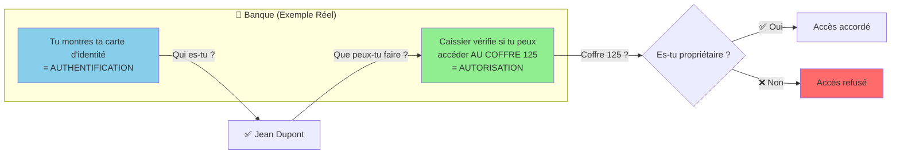

# Exercices Pratiques : Enseigner l'Autorisation

**Exercices simples et progressifs pour comprendre l'autorisation**

---

## Plan de Cours (2-3 heures)

### Structure Recommandée

| Partie | Durée | Objectif |
|--------|-------|----------|
| **1. Concepts** | 20 min | Comprendre Auth vs Authz |
| **2. Exercice 1** | 30 min | Protection basique (roles) |
| **3. Exercice 2** | 40 min | Protection resource-based |
| **4. Exercice 3** | 30 min | Protection database (RLS) |
| **5. Démonstration** | 30 min | Comparer approches |

---

## PARTIE 1 : Introduction (20 min)

### Concept à Expliquer

**Authentification** : Qui es-tu ?
- ✅ Facile à implémenter
- ✅ Login, vérification identité
- ✅ Une fois par session

**Autorisation** : Que peux-tu faire ?
- ❌ Difficile à implémenter
- ❌ Vérification à chaque action
- ❌ Complexe et répétitif

### Exemple Quotidien à Utiliser



**Message clé** : On peut identifier quelqu'un (auth) mais il ne peut pas tout faire (authz)

---

## EXERCICE 1 : Protection par Rôles (30 min)

### Scénario Simple

**Application** : Blog avec articles

**Rôles** :
- **Visiteur** : Peut lire articles
- **Membre** : Peut lire + commenter
- **Admin** : Peut tout faire

### Tableau Permissions

| Action | Visiteur | Membre | Admin |
|--------|----------|--------|-------|
| **Lire article** | ✅ | ✅ | ✅ |
| **Commenter** | ❌ | ✅ | ✅ |
| **Créer article** | ❌ | ❌ | ✅ |
| **Supprimer article** | ❌ | ❌ | ✅ |

---

### Exercice Pratique

**Instructions étudiants** :

**Étape 1** : Créer table permissions (15 min)

Donnez le tableau vide :

| Action | Visiteur | Membre | Admin |
|--------|----------|--------|-------|
| Lire article | ? | ? | ? |
| Éditer article | ? | ? | ? |
| Supprimer article | ? | ? | ? |
| Voir commentaires | ? | ? | ? |
| Créer commentaire | ? | ? | ? |
| Supprimer commentaire | ? | ? | ? |

**Question** : Remplir le tableau (✅ ou ❌)

---

**Étape 2** : Identifier problèmes (10 min)

**Scénario** : Jean (Membre) essaie de supprimer l'article de Marie

**Question** : Que doit vérifier le système ?

**Réponse attendue** :
1. Jean est-il authentifié ? (Auth)
2. Jean a-t-il le rôle "Admin" ? (Authz par rôle)

---

**Étape 3** : Cas limite (5 min)

**Question** : Marie veut éditer SON propre article, mais elle n'est pas Admin. Autorisé ?

**Réponse attendue** :
- Avec rôles simples : ❌ Refusé (pas Admin)
- Avec ownership : ✅ Autorisé (c'est son article)

**Enseignement** : Les rôles seuls ne suffisent pas !

---

## EXERCICE 2 : Protection Resource-Based (40 min)

### Scénario Plus Complexe

**Application** : Gestion de projets

**Besoin** : User peut éditer SES projets, pas ceux des autres

### Tableau Comparatif

| User | Action | Project | Autorisé ? | Pourquoi |
|------|--------|---------|-----------|----------|
| Alice | Éditer | Project 1 (Alice) | ✅ | Propriétaire |
| Alice | Éditer | Project 2 (Bob) | ❌ | Pas propriétaire |
| Bob | Supprimer | Project 2 (Bob) | ✅ | Propriétaire |
| Admin | Éditer | Project 1 (Alice) | ✅ | Admin peut tout |

---

### Exercice Pratique

**Étape 1** : Analyser scénarios (15 min)

Donnez tableau à compléter :

| User | Rôle | Action | Resource | Autorisé ? |
|------|------|--------|----------|-----------|
| Jean | Membre | Lire | Article public | ? |
| Jean | Membre | Éditer | Son article | ? |
| Jean | Membre | Éditer | Article de Marie | ? |
| Marie | Admin | Éditer | Article de Jean | ? |
| Visiteur | - | Lire | Article privé | ? |

**Réponses** :
1. ✅ Oui (public)
2. ✅ Oui (propriétaire)
3. ❌ Non (pas propriétaire, pas admin)
4. ✅ Oui (admin)
5. ❌ Non (privé)

---

**Étape 2** : Identifier vérifications nécessaires (15 min)

**Question** : Pour "Jean édite son article", que doit vérifier le système ?

**Réponse attendue** :
1. Jean est-il authentifié ? ✅
2. L'article existe-t-il ? ✅
3. Jean est-il propriétaire de l'article ? ✅
4. OU Jean est-il Admin ? ✅

**Enseignement** : 4 vérifications pour 1 action !

---

**Étape 3** : Problème du code répétitif (10 min)

**Question** : Si on a 20 endpoints (lire, éditer, supprimer × 5 resources), combien de vérifications ?

**Réponse** : 20 × 4 = 80 vérifications à coder

**Enseignement** : Code répétitif = risque d'oubli = faille sécurité

---

## EXERCICE 3 : Protection Database (RLS) (30 min)

### Concept à Démontrer

**Protection au niveau Database = Automatique**

### Scénario Démonstration

**Application** : Plateforme de cours avec abonnements

**Tiers** :
- **Free** : Cours gratuits
- **Basic** : Cours gratuits + basic
- **Pro** : Tous cours

---

### Tableau Cas d'Usage

| User | Tier | Cours | Tier Cours | Accès ? |
|------|------|-------|-----------|---------|
| Alice | Free | "Intro Git" | Free | ✅ |
| Alice | Free | "React Avancé" | Basic | ❌ |
| Bob | Basic | "Intro Git" | Free | ✅ |
| Bob | Basic | "React Avancé" | Basic | ✅ |
| Bob | Basic | "Architecture" | Pro | ❌ |
| Charlie | Pro | "Architecture" | Pro | ✅ |

---

### Exercice Pratique

**Étape 1** : Sans RLS (15 min)

**Question** : Combien de vérifications dans le code pour protéger 10 cours ?

**Réponse attendue** :
- Vérifier user authentifié : 1×
- Vérifier tier user : 1×
- Vérifier tier cours : 1×
- Comparer tiers : 1×
- **Total : 4 vérifications × 10 cours = 40 lignes de code**

**Code exemple (simplifié)** :
```
Function GetCourse(courseId):
  user = getCurrentUser()
  if not user: return Error("Not authenticated")
  
  course = database.getCourse(courseId)
  if not course: return Error("Not found")
  
  // ❌ Vérification manuelle
  if user.tier == "free" and course.tier != "free":
    return Error("Upgrade required")
  
  if user.tier == "basic" and course.tier == "pro":
    return Error("Upgrade required")
  
  return course
```

---

**Étape 2** : Avec RLS (15 min)

**Démonstration** : RLS vérifie automatiquement

**Policy SQL (montrer simplement)** :
```sql
User peut voir cours SI :
  - Cours.tier = 'free'
  OU
  - User.tier = 'basic' ET Cours.tier IN ('free', 'basic')
  OU
  - User.tier = 'pro'
```

**Code application** :
```
Function GetCourse(courseId):
  // ✅ RLS vérifie automatiquement
  return database.getCourse(courseId)
  
  // Si user pas autorisé → database retourne rien
```

**Enseignement** : 
- Sans RLS : 40 lignes
- Avec RLS : 2 lignes
- **Économie : 38 lignes = moins de bugs**

---

## EXERCICE 4 : Cas Réel Complet (30 min)

### Scénario Réaliste

**Application** : Marketplace de services (comme ton projet cours/images)

**Fonctionnalités** :
1. Voir catalogue cours → Tous
2. Acheter cours → Membres
3. Accéder contenu cours → Si acheté
4. Télécharger images → Selon plan
5. Créer cours → Instructeurs
6. Modérer cours → Admins

---

### Tableau à Compléter en Groupe

**Instructions** : Compléter le tableau de permissions

| Action | Visiteur | Membre Free | Membre Pro | Instructeur | Admin |
|--------|----------|-------------|------------|-------------|-------|
| Voir catalogue | ? | ? | ? | ? | ? |
| Acheter cours | ? | ? | ? | ? | ? |
| Voir contenu cours acheté | ? | ? | ? | ? | ? |
| Download 10 images/mois | ? | ? | ? | ? | ? |
| Download 100 images/mois | ? | ? | ? | ? | ? |
| Créer nouveau cours | ? | ? | ? | ? | ? |
| Éditer son cours | ? | ? | ? | ? | ? |
| Éditer cours autre | ? | ? | ? | ? | ? |
| Supprimer cours | ? | ? | ? | ? | ? |

---

### Réponses (Correction)

| Action | Visiteur | Membre Free | Membre Pro | Instructeur | Admin |
|--------|----------|-------------|------------|-------------|-------|
| Voir catalogue | ✅ | ✅ | ✅ | ✅ | ✅ |
| Acheter cours | ❌ | ✅ | ✅ | ✅ | ✅ |
| Voir contenu cours acheté | ❌ | ✅ | ✅ | ✅ | ✅ |
| Download 10 images/mois | ❌ | ✅ | ✅ | ✅ | ✅ |
| Download 100 images/mois | ❌ | ❌ | ✅ | ✅ | ✅ |
| Créer nouveau cours | ❌ | ❌ | ❌ | ✅ | ✅ |
| Éditer son cours | ❌ | ❌ | ❌ | ✅ | ✅ |
| Éditer cours autre | ❌ | ❌ | ❌ | ❌ | ✅ |
| Supprimer cours | ❌ | ❌ | ❌ | ❌ | ✅ |

---

### Discussion Guidée (15 min)

**Questions à poser** :

**Q1** : Combien de vérifications différentes avez-vous identifié ?
**R1** : Au moins 5 types (role, ownership, tier, limite downloads, statut achat)

**Q2** : Si on a 20 endpoints, combien de fois on répète ces vérifications ?
**R2** : 20 × 5 = 100 vérifications à coder

**Q3** : Que se passe-t-il si on oublie UNE vérification ?
**R3** : Faille de sécurité (user accède contenu non autorisé)

**Q4** : Comment éviter d'oublier ?
**R4** : Protection automatique (RLS)

---

## DÉMONSTRATION LIVE : Comparaison Approches

### Setup pour Démonstration

**Prépare 2 exemples côte à côte** :

### Démo 1 : Protection Manuelle (15 min)

**Pseudo-code à montrer** :

```
// Endpoint: Éditer cours
Function EditCourse(courseId, newTitle):
  
  // ❌ Vérification 1: Auth
  user = getCurrentUser()
  if not user:
    return Error(401, "Not authenticated")
  
  // ❌ Vérification 2: Course exists
  course = database.getCourse(courseId)
  if not course:
    return Error(404, "Not found")
  
  // ❌ Vérification 3: Ownership
  if course.instructorId != user.id:
    // Vérification 4: Admin override
    if user.role != "admin":
      return Error(403, "Forbidden")
  
  // ❌ Vérification 5: Status
  if course.status == "published" and user.role != "admin":
    return Error(403, "Cannot edit published course")
  
  // Enfin... update
  course.title = newTitle
  database.update(course)
  
  return Success(course)
```

**Comptez ensemble** :
- Lignes code : ~25
- Vérifications : 5
- Possibilités d'erreur : 5

**Question classe** : "Imaginez 20 endpoints comme ça. Combien de lignes ?"
**Réponse** : 500 lignes de vérifications !

---

### Démo 2 : Protection RLS (15 min)

**Pseudo-code à montrer** :

```
// Endpoint: Éditer cours
Function EditCourse(courseId, newTitle):
  
  user = getCurrentUser()
  if not user:
    return Error(401, "Not authenticated")
  
  // ✅ RLS vérifie AUTOMATIQUEMENT tout le reste
  course = database.updateCourse(courseId, {title: newTitle})
  
  // Si pas autorisé, database retourne null
  if not course:
    return Error(403, "Forbidden or not found")
  
  return Success(course)
```

**Comptez ensemble** :
- Lignes code : ~8
- Vérifications manuelles : 1 (auth)
- Vérifications automatiques (RLS) : 4

**Configuration RLS (montrer juste)** :
```sql
User peut modifier cours SI :
  - User est instructeur du cours
  OU
  - User a rôle "admin"
```

---

### Comparaison Visuelle

**Dessinez au tableau** :

```
Approche Manuelle              Approche RLS
================              ============
25 lignes × 20 endpoints      8 lignes × 20 endpoints
= 500 lignes                  = 160 lignes

5 vérifications à répéter     1 vérification (auth)
= Risque oubli                = Protection auto

Maintenance difficile         Maintenance facile
```

---

## EXERCICE 5 : Études de Cas (30 min)

### Format Exercice

**Diviser classe en groupes (3-4 personnes)**

Chaque groupe reçoit un cas et doit :
1. Identifier les rôles nécessaires
2. Lister les vérifications par endpoint
3. Choisir approche (manuelle vs RLS)

---

### CAS 1 : Application de Recettes

**Fonctionnalités** :
- Voir recettes publiques
- Créer recette (user)
- Éditer sa recette (propriétaire)
- Supprimer recette (propriétaire)
- Modérer recettes (admin)

**Questions groupe** :
1. Combien de rôles différents ?
2. Combien de vérifications par endpoint ?
3. Protection manuelle ou RLS ?

**Réponses attendues** :
1. 3 rôles (visiteur, user, admin)
2. 3-4 vérifications (auth, ownership, status)
3. RLS recommandé (vérifications répétitives)

---

### CAS 2 : SaaS Multi-tenant

**Fonctionnalités** :
- Voir projets de SON organisation
- Créer projet (membre org)
- Éditer projet (créateur ou admin org)
- Inviter membre (admin org)

**Questions groupe** :
1. Comment isoler données par organisation ?
2. Vérifications nécessaires par endpoint ?
3. Approche recommandée ?

**Réponses attendues** :
1. Filtrer par organization_id partout
2. 4-5 vérifications (auth, org membership, role, ownership)
3. RLS OBLIGATOIRE (isolation critique)

---

### CAS 3 : E-commerce avec Abonnements

**Fonctionnalités** :
- Voir produits (tous)
- Acheter (membres)
- Accéder downloads (selon plan)
- Limite downloads (10/mois Basic, 100/mois Pro)

**Questions groupe** :
1. Comment gérer limites downloads ?
2. Vérifications par endpoint ?
3. Protection manuelle faisable ?

**Réponses attendues** :
1. Compteur dans DB + vérification
2. Auth + tier + compteur + date reset = 4 vérifications
3. ⚠️ Difficile manuellement (RLS + trigger mieux)

---

## DÉMONSTRATION FINALE : Live Coding (30 min)

### Option A : Démo Supabase (Recommandé)

**Ce que tu montres en live** :

**1. Créer compte Supabase** (2 min)
- Aller sur supabase.com
- Créer projet
- Montrer dashboard

**2. Créer table simple** (3 min)
```sql
CREATE TABLE articles (
  id SERIAL PRIMARY KEY,
  title TEXT,
  user_id UUID REFERENCES auth.users,
  is_public BOOLEAN DEFAULT false
);
```

**3. Activer RLS** (1 min)
```sql
ALTER TABLE articles ENABLE ROW LEVEL SECURITY;
```

**4. Créer policy simple** (5 min)
```sql
-- Policy 1 : Tout le monde voit articles publics
CREATE POLICY "Public articles readable"
ON articles FOR SELECT
USING (is_public = true);

-- Policy 2 : User voit SES articles
CREATE POLICY "Users see own articles"
ON articles FOR SELECT
USING (auth.uid() = user_id);

-- Policy 3 : User modifie SEULEMENT ses articles
CREATE POLICY "Users update own articles"
ON articles FOR UPDATE
USING (auth.uid() = user_id);
```

**5. Tester** (10 min)
- Créer 2 users
- User A crée article privé
- User B essaie d'y accéder → ❌ Refusé (auto)
- User A édite son article → ✅ OK

**6. Montrer que c'est impossible à contourner** (5 min)
- Même en SQL direct
- Même si API hackée
- RLS protège TOUJOURS

**Message final** : "0 lignes de code dans l'API, protection maximale"

---

### Option B : Démo Comparative (Alternative)

**Montrer 2 approches en parallèle** :

**Écran gauche : Code manuel**
```
Endpoint EditArticle:
  - Check auth (5 lignes)
  - Check exists (3 lignes)
  - Check ownership (5 lignes)
  - Update (3 lignes)
Total: 16 lignes

× 10 endpoints = 160 lignes
```

**Écran droit : Avec RLS**
```
Endpoint EditArticle:
  - Check auth (1 ligne)
  - Update (RLS vérifie) (3 lignes)
Total: 4 lignes

× 10 endpoints = 40 lignes
```

**Économie : 120 lignes = moins de bugs**

---

## Exercice Récapitulatif Final (15 min)

### Quiz Rapide

**Question 1** : Quelle est la différence entre authentification et autorisation ?
- A) C'est la même chose
- B) Auth = qui es-tu, Authz = que peux-tu faire ✅
- C) Auth = sécurité, Authz = performance

**Question 2** : Combien de vérifications pour "User édite SON article" ?
- A) 1 (auth uniquement)
- B) 2 (auth + ownership)
- C) 4 (auth + exists + ownership + status) ✅

**Question 3** : Avantage principal de RLS ?
- A) Plus rapide
- B) Protection automatique, impossible d'oublier ✅
- C) Plus facile à coder

**Question 4** : Pour projet avec abonnements (Free, Pro), approche recommandée ?
- A) Code manuel partout
- B) Middleware
- C) RLS database-level ✅

---

## Matériel Pédagogique à Préparer

### Avant le Cours

**1. Slides (10-15 slides)** :
- Slide 1 : Auth vs Authz
- Slide 2 : Exemple banque
- Slide 3-4 : Protection par rôles
- Slide 5-6 : Protection resource-based
- Slide 7-8 : RLS concept
- Slide 9 : Comparaison approches
- Slide 10 : Quiz

**2. Tableaux vides à imprimer** :
- Tableau permissions (Exercice 1)
- Tableau scénarios (Exercice 2)
- Tableau cas d'usage (Exercice 3)

**3. Compte Supabase démo** :
- Pré-créer compte
- Tables déjà créées
- Quelques users de test

---

## Timing Recommandé

### Planning 2-3h

| Temps | Activité | Format |
|-------|----------|--------|
| **0-20 min** | Introduction concepts | Présentation + exemple banque |
| **20-50 min** | Exercice 1 : Rôles | Groupe + correction |
| **50-90 min** | Exercice 2 : Resource-based | Groupe + correction |
| **90-120 min** | Exercice 3 : RLS | Individuel + correction |
| **120-150 min** | Démo live Supabase | Live coding |
| **150-165 min** | Quiz récap | Classe entière |
| **165-180 min** | Questions/discussion | Ouvert |

---

## Messages Clés à Faire Passer

### Top 5 Enseignements

**1. Authentification ≠ Autorisation**
- Auth = qui (facile)
- Authz = quoi faire (difficile)

**2. Rôles Seuls Insuffisants**
- Rôles : admin, user
- Mais aussi : ownership, tier, limites

**3. Code Répétitif = Risque**
- 20 endpoints = 500 lignes vérifications
- 1 oubli = faille sécurité

**4. Protection Database > Application**
- App-level : contournable si erreur
- DB-level : impossible à contourner

**5. Solutions Modernes Facilitent**
- RLS (Supabase) = authz automatique
- Économie temps + bugs

---

## Exercice Bonus (Si Temps)

### Cas Piège : Faille de Sécurité

**Donnez ce code (volontairement buggé)** :

```
Endpoint DeleteArticle(articleId):
  user = getCurrentUser()
  if not user:
    return Error("Not authenticated")
  
  // ❌ OUBLI : Pas de vérification ownership
  database.deleteArticle(articleId)
  
  return Success("Deleted")
```

**Question classe** : "Quel est le problème ?"

**Réponse attendue** :
- Pas de vérification ownership
- N'importe quel user connecté peut supprimer n'importe quel article
- = Faille de sécurité critique

**Enseignement** :
- 1 ligne oubliée = catastrophe
- Avec RLS → impossible (DB refuse automatiquement)

---

## Comparaison Solutions à Montrer

### Tableau Simplifié pour Étudiants

| Approche | Exemple | Vérifications | Risque Oubli | Code | Recommandé |
|----------|---------|---------------|--------------|------|------------|
| **Manuelle** | Code if/else partout | ❌ À chaque fois | Élevé | 500 lignes | ❌ |
| **Middleware** | Fonction réutilisable | ⚠️ À appeler | Moyen | 200 lignes | ⚠️ |
| **RLS** | Database vérifie | ✅ Automatique | Aucun | 50 lignes SQL | ✅ |

**Question finale** : "Quelle approche choisiriez-vous pour un projet réel ?"

**Réponse attendue** : RLS (moins de code, moins de bugs, sécurité maximale)

---

## Ressources pour Étudiants

### À Distribuer Après le Cours

**1. Cheat Sheet** :

| Concept | Définition Simple | Exemple |
|---------|------------------|---------|
| **Authentification** | Qui es-tu ? | Login avec email/password |
| **Autorisation** | Que peux-tu faire ? | Admin peut supprimer |
| **Rôle** | Catégorie d'utilisateur | Admin, User, Moderator |
| **Permission** | Action autorisée | Peut éditer, peut supprimer |
| **Ownership** | Propriété resource | Mon article, pas le tien |
| **RLS** | Protection database | PostgreSQL vérifie auto |
| **Policy** | Règle autorisation | "Users see own data" |

---

**2. Comparaison Solutions** :

| Solution | Authz Auto | Complexité | Prix | Apprendre |
|----------|-----------|------------|------|-----------|
| **Supabase** | ✅ RLS | Moyenne | 0-25 $ | ✅ |
| **Firebase** | ✅ Rules | Moyenne | 0-50 $ | ✅ |
| **Clerk** | ❌ Manuel | Faible | 25-225 $ | ✅ |
| **Code manuel** | ❌ | Élevée | 0 $ | ⚠️ |

---

**3. Exercices à faire chez soi** :

- Créer compte Supabase gratuit
- Suivre tutorial RLS
- Créer 3 policies simples
- Tester avec 2 users

---

## Conseils Pédagogiques

### Pour Bien Faire Passer

**1. Commencer par l'exemple concret** (banque, coffre)
- Pas de théorie abstraite
- Analogie réelle
- Classe comprend immédiatement

**2. Montrer le problème AVANT la solution**
- Montrer code répétitif (500 lignes)
- Montrer risque d'oubli
- PUIS montrer RLS comme solution

**3. Live demo > Slides**
- Créer vraiment un compte Supabase
- Créer vraiment une table
- Tester vraiment avec 2 users
- Plus impactant que slides

**4. Insister sur les chiffres**
- 500 lignes vs 50 lignes
- 20 jours vs 3 jours
- 1 oubli = faille

**5. Quiz interactif**
- Poser questions pendant exercices
- Faire participer
- Corriger ensemble

---

## Timing Alternatifs

### Version Courte (1h)

| Temps | Activité |
|-------|----------|
| **0-10 min** | Concepts (exemple banque) |
| **10-30 min** | Exercice 1 (rôles) |
| **30-50 min** | Démo RLS live |
| **50-60 min** | Quiz + questions |

---

### Version Longue (3h)

| Temps | Activité |
|-------|----------|
| **0-20 min** | Introduction |
| **20-50 min** | Exercice 1 (rôles) |
| **50-90 min** | Exercice 2 (resource-based) |
| **90-120 min** | Exercice 3 (RLS) |
| **120-150 min** | Cas réels groupes |
| **150-165 min** | Démo comparative |
| **165-180 min** | Synthèse + quiz |

---

## Conclusion du Cours

### Messages à Répéter

**1. Autorisation ≠ Authentification**
- 80% de la complexité = autorisation
- Pas juste "est-il connecté"

**2. Rôles Seuls Insuffisants**
- Besoin ownership, tiers, limites

**3. Code Répétitif = Danger**
- 1 oubli = faille
- Automatisation nécessaire

**4. Solutions Modernes Aident**
- RLS = protection automatique
- Moins de code = moins de bugs

**5. Choix Architecture = Impact Long Terme**
- Décision initiale détermine vélocité
- Bien choisir dès le début

---

## Évaluation Recommandée

### Quiz Final (10 questions)

**Format** : QCM ou Vrai/Faux

**Exemples questions** :

1. ❓ L'authentification vérifie que peut faire un user (V/F)
   → Faux (c'est l'autorisation)

2. ❓ Avec RLS, protection au niveau : A) App, B) Database, C) Client
   → B) Database

3. ❓ Protection manuelle dans 20 endpoints = combien de vérifications ?
   → ~80-100

4. ❓ Avantage principal RLS ?
   → Protection automatique, impossible d'oublier

5. ❓ Pour app avec abonnements Free/Pro, meilleure approche ?
   → RLS database-level

---

## Matériel à Télécharger

### Checklist Préparation

**Avant le cours** :
- [ ] Créer compte Supabase démo
- [ ] Préparer tables exemples
- [ ] Créer 2-3 users de test
- [ ] Préparer slides (10-15)
- [ ] Imprimer tableaux exercices
- [ ] Tester live demo (répéter)

**Pendant le cours** :
- [ ] Partager lien Supabase
- [ ] Partager tableaux vides
- [ ] Faire participer activement
- [ ] Montrer code comparatif
- [ ] Insister sur chiffres clés

**Après le cours** :
- [ ] Partager ressources (cheat sheet)
- [ ] Tutorial Supabase RLS
- [ ] Exercices maison
- [ ] Liens documentation

---

## Succès du Cours

### Critères de Réussite

**Étudiants doivent comprendre** :
- ✅ Différence auth vs authz
- ✅ Pourquoi code répétitif = risque
- ✅ Comment RLS protège automatiquement
- ✅ Quelle solution choisir (Supabase)

**Étudiants doivent pouvoir** :
- ✅ Identifier vérifications nécessaires
- ✅ Créer tableau permissions
- ✅ Comparer approches
- ✅ Créer policy RLS simple

---

**Bon cours ! Les exercices progressifs + démo live Supabase = maximum impact pédagogique.** 🎓

